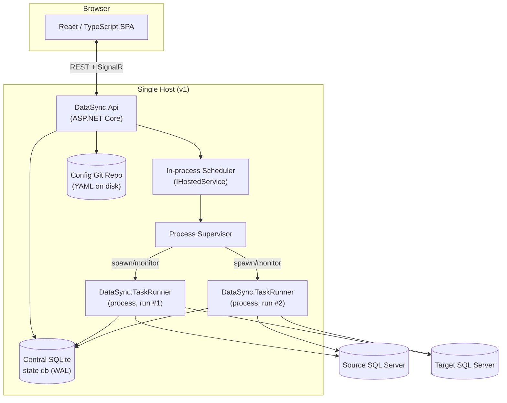

# DataSync — Detailed Architecture

This document expands the concepts in `architecture/planning/` (`overview.md`, `architecture.md`,
`tech-stack.md`) into a concrete system design. It supersedes nothing there — the planning docs
remain the source notes; this is the resolved design built from them.

## 1. System Overview

DataSync is an open-source, cross-platform data replication tool. v1 supports MSSQL → MSSQL
replication only, using SQL Server's native Change Tracking / CDC features to detect source changes.
The architecture is intentionally engine-agnostic at its core so that additional source/target
database engines can be added later without redesigning the system (see [§5](#5-extensibility-model)).

Four pillars shape every component decision in this design:

1. **Config lives on disk, in git.** Every replication (connections, table mappings, scheduling,
   change-processing settings) is a set of files in a git repository. The web app is the primary
   editor of these files, and **auto-commits on every save** — there is no separate "publish" step.
   Git history *is* the config audit trail.
2. **State lives in one central SQLite database.** Run history, log lines, and change-tracking
   watermarks are all tracked in a single SQLite file, not scattered across per-task databases. This
   trades away some write-concurrency headroom for simpler cross-task querying and a single place to
   back up/inspect; the design below (§3.6) exists specifically to make that trade-off safe.
3. **Data movement happens in a separate OS process per task run.** The web app never moves data
   in-process. It spawns a short-lived `DataSync.TaskRunner` process for each replication run, and
   that process is solely responsible for reading, staging, and applying changes for that one task.
4. **The web app is the orchestrator, not a data mover.** It hosts the UI, the config/git layer, an
   in-process scheduler, and process supervision — but the actual driver/reader/writer/caching logic
   (per `architecture/planning/done/architecture.md`) lives in libraries shared with the Task Runner, not
   in the web app itself.

## 2. High-Level Component Diagram



## 3. Component Details

### 3.1 Web API / Orchestrator (`DataSync.Api`, ASP.NET Core)

The API process is the only long-running server component in v1. It owns:

- **Config CRUD endpoints** — create/edit connections, replications, table mappings, column
  mappings, scheduling settings. Every write goes through the config layer (§3.5), which persists to
  disk and commits to git.
- **Metadata browsing endpoints** — on demand, connect to a configured source/target and introspect
  databases/tables/columns so the SPA's table-mapping UI can present real schema instead of requiring
  hand-typed names. This reuses the driver abstraction (§3.4) in "metadata-only" mode; no data moves.
- **Scheduler** (`IHostedService`) — evaluates every enabled task's scheduling config
  (`Continuous` with a frequency, or `Periodic` on a cron expression, per
  `architecture/planning/done/architecture.md`) on a tick and decides which tasks are due to run.
- **Process Supervisor** — spawns a `DataSync.TaskRunner` child process for each due run
  (`System.Diagnostics.Process`), passing the task's config path and a generated run id. Tracks PID,
  start time, and liveness; writes/updates the run's row in the central SQLite `TaskRuns` table;
  detects crashed/orphaned processes on API restart by reconciling PIDs still marked `Running` in
  SQLite against the OS process table. Enforces **one running instance per task** via the `RunLocks`
  table (§3.6) so a slow run doesn't overlap with the next scheduled trigger.
- **Manual controls** — REST endpoints to trigger a run immediately and to request cancellation of a
  running task (the supervisor signals the child process, e.g. via a cooperative cancellation file or
  process kill as a last resort).
- **Live status/log streaming** — a SignalR hub pushes run status transitions and tailed log lines to
  connected SPA clients; the API polls the central SQLite `Logs`/`TaskRuns` tables (or is notified
  in-process by the supervisor for its own spawned processes) and republishes over the hub. A plain
  polling REST endpoint exists as a fallback/for non-realtime clients.

### 3.2 React / TypeScript SPA (`DataSync.Web`)

Talks to `DataSync.Api` over REST for CRUD and SignalR for live updates. Core views:

- **Connections** — list/create/edit connections (hostname, auth, which database engine driver).
- **Replication / Task Builder** — the main authoring surface: pick source connection/database/table
  (browsed via the metadata endpoints), pick target, define column mappings and transforms, define
  source filters, choose scheduling (continuous vs. periodic + parameters), and choose change
  processing settings (which reader/cache/writer, parallelism, custom options) from what the selected
  driver advertises as supported (per the driver-capability model in
  `architecture/planning/done/architecture.md`).
- **Run Dashboard** — per-task run history, current status, rows read/written, errors; a live log
  tail view backed by the SignalR hub for in-progress runs.
- **Config History** — a read-only view of a replication's git log (commit list + diffs), giving
  visibility into the auto-commit trail without needing a separate git client.

### 3.3 Task Runner (`DataSync.TaskRunner`)

A console application, one OS process per task run. Invoked by the Supervisor as:

```
DataSync.TaskRunner --task-config <path/to/task.yaml> --run-id <guid>
```

Pipeline, all stages driven by the driver abstraction (§3.4):

1. Load and validate the task config; resolve source/target connections (and secrets, §3.5).
2. **Change Reader** — pull a result set of changed rows plus row/batch-level change markers from the
   source, using whichever reader the task config selects (Change Tracking, CDC, or generic batch).
3. **Change Cache / Staging** — persist the change set using whichever staging method the task
   config selects (v1: target-specific staging tables; parquet/generic staging deferred, §5).
4. **Change Writer** — apply the staged changes to the target (merge statement, or ordered
   insert/update/delete, or a batch reload — full delete+reload — depending on what the writer/config
   selects).
5. **Watermark update** — record the new watermark (change-tracking version/LSN, or a plain
   watermark-column value for the fallback reader) per source table in the central SQLite
   `ChangeWatermarks` table, so the next run resumes from the right point.
6. **Run completion** — write final status, row counts, and any error to `TaskRuns`; exit with a
   status code reflecting success/failure so the Supervisor doesn't need to parse output to know the
   outcome.

Throughout, structured log lines are written to the central SQLite `Logs` table (batched, not one
transaction per line — see §3.6 concurrency notes) so the API can surface them live.

### 3.4 Driver Abstraction Layer (`DataSync.Drivers.Abstractions`)

Shared library referenced by both `DataSync.Api` (metadata browsing) and `DataSync.TaskRunner` (data
movement). Directly mirrors `architecture/planning/done/architecture.md`'s concepts as interfaces:

- `IDriver` — identifies a database engine; advertises which `IChangeReader`, `IStagingProvider`, and
  `IChangeWriter` implementations it supports, plus metadata introspection (databases/tables/columns,
  native↔generic type mapping).
- `IChangeReader` — produces a change result set + change markers. Implementations may be
  driver-specific (MSSQL Change Tracking/CDC) or generic (batch `WHERE x > y`).
- `IStagingProvider` (Change Cache) — persists a change set before it's applied. Implementations may
  be generic (parquet — later) or target-specific (a staging/temp table via bulk insert).
- `IChangeWriter` — applies a staged change set to the target. Implementations may be generic
  (ordered insert/update/delete) or target-specific (merge, bulk operations).

A **driver registry** in `DataSync.Api` and `DataSync.TaskRunner` startup enumerates registered
`IDriver` implementations so the UI can only offer combinations a driver actually supports, and so a
task config referencing an unsupported reader/writer/cache combination fails validation early.

### 3.5 MSSQL Driver v1 (`DataSync.Drivers.MsSql`)

The only driver implemented in v1, built against the abstractions above:

- **Metadata**: `INFORMATION_SCHEMA`/catalog-view based introspection of databases, tables, columns,
  and native types.
- **Readers**, in build order:
  1. **Change Tracking** (recommended starting point — simpler to enable and query than CDC, no
     capture job/log reader involved).
  2. **CDC** (higher fidelity — captures intermediate updates/deletes CT can miss — added once CT
     path is proven).
  3. **Watermark** (`WHERE x > y` against a configured watermark column) as a fallback for tables
     without CT/CDC enabled. Not to be confused with a **batch reload** — a distinct, not-yet-built
     concept for a full or list/range-segmented backfill of a table (see the Backlog section in
     `implementation-plan.md`); this reader is the ongoing incremental-sync fallback, not a reload
     mechanism.
- **Staging**: target-specific staging table populated via `SqlBulkCopy`, created/truncated per run.
- **Writer**: `MERGE` statement from the staging table into the target as the primary path; ordered
  insert/update/delete statements as a fallback for targets/scenarios where `MERGE` is unsuitable.

### 3.6 Config Store (git repo on disk)

**Layout** (proposed, under a configurable root, e.g. `config/`):

```
config/
  connections/
    <connection-name>.yaml
  replications/
    <replication-name>/
      task.yaml               # scheduling, change-processing settings
      table-mappings/
        <mapping-name>.yaml    # source/target tables, filters, column mappings
```

**Format**: YAML — human-readable and git-diff-friendly, which matters since diffs are the audit
trail.

**Auto-commit on save**: every API write to a config file is followed immediately by a git commit,
implemented via **LibGit2Sharp** (an in-process library, not shelling out to the `git` binary) for
cross-platform reliability and to avoid depending on a system git install. Commits are authored using
the acting web user's identity (name/email captured at login or configured per user) so `git log`
reads as a real per-user audit trail, with a generated message summarizing what changed (e.g.
`"Update table mapping 'orders' on replication 'crm-sync'"`).

**Secrets**: connection credentials must **not** be committed to git in plaintext. Connection YAML
files store only a **secret reference** (a key/identifier), never an inline password. Actual
credential values are resolved at runtime through
**[`ClrKernel.Core.Secrets.SecretStore`](https://www.nuget.org/)** (public NuGet package, maintained
by the DataSync team), which wraps the OS-native credential store (Windows Credential Manager /
macOS Keychain / Linux Secret Service, depending on platform) behind a single cross-platform API.
`DataSync.Core` takes a package dependency on it; both `DataSync.Api` (for saving/testing
connections from the UI) and `DataSync.TaskRunner` (for resolving credentials before connecting to a
source/target) use it identically, so there is exactly one code path that ever touches a raw
credential value. Because the underlying store is per-OS-user, this implies **v1 deployment runs the
API and every spawned Task Runner process under one consistent local account** — see the deployment
note in [§7](#7-deployment-topology-v1).

### 3.7 Central SQLite State Store (`DataSync.State`)

A single database, shared by `DataSync.Api` and every `DataSync.TaskRunner` process. **SQLite by
default** — a file, no server to run — and since phase 63 optionally SQL Server or PostgreSQL, chosen
once per deployment via `DataSync:StateEngine`. The stores are written against one SQL text and one
parameter spelling; `StateDialect` renders the four things the engines actually disagree about
(auto-assigned keys, unbounded vs indexable text, integer width, and `ALTER TABLE ... ADD`) plus the
three that differ structurally (upsert, row limiting, and where the schema version is kept).
**Schema sketch**:

| Table | Purpose |
|---|---|
| `Tasks` | One row per configured replication task (mirrors config's `Enabled`, for fast joins/reporting — the config file remains source of truth). Also carries `Paused`/`PauseNote`, which are **not** a mirror of anything: a pause is state-only, never committed, and is the scheduler's second gate. `ShouldRun := Enabled && !Paused` (phase 64). |
| `TaskRuns` | One row per **unit of work** — a table mapping's own Primary (incremental) pass, or one segment of a Backfill (reload) — not one row per replication invocation. Run id, task/mapping name, run kind (`Primary`/`Backfill`), segment label, PID, start/end time, status (`Queued`/`Pending`/`Running`/`Succeeded`/`Failed`/`Cancelled`), rows read/written, error summary. |
| `ChangeWatermarks` | Per task + source table: last-processed watermark (change-tracking version/LSN, or a plain column value for the fallback reader), updated at end of a successful **Primary** reader stage only — a Backfill unit of work never touches this table. |
| `Logs` | Structured log lines: run id, timestamp, level, message. |
| `RunLocks` | One row per `(task, run kind, table mapping)` while that mapping's unit of work is in flight — a Primary pass and a Backfill both scoped to the same mapping serialize against each other; different mappings of the same replication (even under the same run kind) don't. |
| `PauseEvents` | Append-only: one row per pause and per resume, with the note entered at the time and who entered it. `Tasks` says what is true now; this says how it got there — a pause changes what the product does without touching the config repo, so without this table it is the one operational act that leaves no trace. Written in the same transaction as the `Tasks` update. No reader yet — see `planning/todo/pause-history-ui.md`. |
| `WorkQueue` | Durable, SQLite-backed cross-process work queue: the API enqueues Primary passes (scheduled or manually triggered) and Backfill segments here; a spawned TaskRunner worker process claims and drains them. See "Per-mapping run model" below. |

**Per-mapping run model** (architecture/implementation/done/phase-008-work-queue-schema.md) — a "run" is
scoped to one table mapping's one unit of work, not a whole replication. This matters at scale: a
replication can have hundreds of table mappings, and treating "trigger a replication" as one shared
run/lock would mean one slow or already-in-flight mapping blocks every other mapping's schedule. A
`RunKind` (`Primary` | `Backfill`) distinguishes a mapping's ongoing incremental sync from an on-demand
reload — only `Primary` ever advances `ChangeWatermarks`, which is what guarantees a Backfill can never
disturb the incremental cursor a `Primary` pass depends on, regardless of which reader/writer it uses
internally.

At most one TaskRunner worker process runs per *replication* (not per mapping, not per trigger) —
spawned on demand (`ProcessSupervisor.EnsureWorkerRunning`, idempotent), it claims items from
`WorkQueue` via a two-step select-then-conditional-update (mirroring `RunLocks`' own
`ON CONFLICT DO NOTHING` idiom) into a bounded internal producer/consumer pipeline
(`System.Threading.Channels`), not a fixed-collection fan-out — the queue's contents can keep growing
while it drains (new due mappings, newly-queued backfills), which a `Parallel.ForEach` over a
pre-enumerated list doesn't accommodate. A `NOT EXISTS` pre-filter in the claim query keeps two
consumers from ever claiming two in-flight items for the same mapping, so different mappings run fully
concurrently while one mapping's own units of work serialize.

**Concurrency strategy** — this is the load-bearing part of choosing a *central* database over
per-task files:

- **Not WAL mode** — WAL's cross-process shared-memory coordination proved unreliable in this
  project's sandboxed dev environment (see `architecture/implementation/done/phase-006-spa.md`); the default
  rollback-journal mode is used instead, backed by the next two mitigations.
- **`busy_timeout`** set on every connection, plus **retry-on-`SQLITE_BUSY`** wrapping every write, so
  transient writer contention is absorbed instead of surfacing as errors.
- **Short transactions** — log lines are batched (buffered in-process, flushed periodically, on a size
  threshold, *and* immediately before any run's terminal status is written — see the phase-8 doc's log-
  flush-ordering fix) rather than one commit per line, and watermark/status updates are single-row
  upserts, minimizing the time any writer holds the write lock.
- All of the above lives in **one shared library** (`DataSync.State`) used identically by the API
  process and every Task Runner process, so the concurrency pattern can't silently drift between
  callers. A dedicated concurrency stress test (`architecture/implementation/done/phase-007-e2e-validation.md`)
  found no contention failures at 8 concurrently-processed mappings — a realistic v1 scale. If
  contention proves problematic at larger scale in practice, the per-task-SQLite-files fallback behind
  this same `DataSync.State` interface remains available.

## 4. End-to-End Data Flow

1. User builds/edits a replication in the SPA (connections, table mapping, scheduling, change
   processing settings).
2. API validates and writes the corresponding YAML file(s) to `config/`, then commits via
   LibGit2Sharp (§3.6). `Tasks` table in SQLite is upserted to mirror the new/changed task.
3. Scheduler tick evaluates the task's schedule; when due (and no `RunLocks` row for that task), it
   asks the Supervisor to start a run.
4. Supervisor creates a `TaskRuns` row (`Pending`→`Running`), acquires the `RunLocks` row, and spawns
   `DataSync.TaskRunner --task-config ... --run-id ...`.
5. Task Runner: reads changes (Change Tracking/CDC/batch) → stages them (staging table) → applies
   them to target (merge/ordered statements) → updates `ChangeWatermarks` → writes final `TaskRuns`
   status → releases the run (Supervisor clears `RunLocks` on process exit).
6. Throughout, log lines land in `Logs`; the API relays status/log changes to connected SPA clients
   over SignalR, and the Run Dashboard reflects them live.
7. On failure, `TaskRuns.Status = Failed` with an error summary; the watermark is *not* advanced past
   the last successfully-applied point, so the next run retries from a consistent position.

## 5. Extensibility Model

- **New source/target database engine**: implement `IDriver` plus whichever `IChangeReader` /
  `IStagingProvider` / `IChangeWriter` variants make sense for that engine, and register it in the
  driver registry. No changes to `DataSync.Api`, `DataSync.TaskRunner`, or the SPA's core flow are
  required — the task builder UI and validation already work off what a driver advertises as
  supported.
- **New staging method** (e.g. parquet, as floated in the planning docs): implement
  `IStagingProvider` once, and it becomes selectable by any driver whose writer can consume it,
  without touching driver-specific code.
- **State store beyond SQLite**: `DataSync.State` is the sole point of contact for run/log/watermark
  persistence. A future non-SQLite backend would implement the same internal interface; nothing in
  `DataSync.Api` or `DataSync.TaskRunner` talks to SQLite directly.

## 6. Security Considerations

- **Secrets**: see §3.6 — credentials never committed to git in plaintext; resolved at runtime via
  `ClrKernel.Core.Secrets.SecretStore` against the OS-native credential store.
- **Least privilege**: documentation/setup guidance should recommend source/target DB accounts scoped
  to only the permissions each reader/writer needs (e.g. `VIEW CHANGE TRACKING`, table-level
  read/write) rather than broad admin rights.
- **SQL generation safety**: the ordered insert/update/delete and batch-reader code paths build SQL
  from config-driven table/column names and parameterized values — table/column identifiers must be
  validated against introspected metadata (never raw user input) and values must always be passed as
  parameters, never string-concatenated, to eliminate SQL injection risk.

## 7. Deployment Topology (v1)

Single host: the `DataSync.Api` process and every `DataSync.TaskRunner` child process it spawns run
on the same machine, with local filesystem access to the config git repo and the central SQLite file.
Multi-node execution (remote agents running Task Runner elsewhere) is explicitly **out of scope for
v1** — the Process Supervisor design (§3.1) assumes local `System.Diagnostics.Process` spawning, not
a distributed job queue.

Because `ClrKernel.Core.Secrets.SecretStore` (§3.6) resolves against the OS-native credential store
of whatever account a process runs as, the API and every spawned Task Runner process must run under
the **same local OS user account** in v1 — otherwise a Task Runner process cannot read credentials
saved via the API. This is a natural fit for single-host, single-service deployment and needs no
extra configuration; it becomes a real constraint only if/when multi-node execution is considered
(§8, backlog).

## 8. Open Questions / Risks

These are called out explicitly rather than silently decided, and should be resolved before or during
the implementation phases that depend on them (see `implementation-plan.md`):

- **Auth/authz** — no login/permission model is specified yet; v1 may need to assume a
  trusted-network single-user deployment unless this is scoped in.
- **Multi-user concurrent config editing** — **investigated in Phase 7**
  (`architecture/implementation/done/phase-007-e2e-validation.md`) with a stress test that triggers 8
  independent replications' config writes concurrently. This surfaced a real bug, not just a policy
  gap: `GitCommitService.CommitChanges` reliably threw `LibGit2Sharp.LockedFileException` ("the index
  is locked") under genuine concurrent writes from the same process — libgit2's index-write lock is
  held too briefly to survive two truly simultaneous `Stage`+`Commit` calls. Fixed with an in-process
  lock around the write path (`GitCommitService` is a DI singleton and the API process is the only
  writer of the config repo, so this fully closes the bug without any cross-process coordination).
  What's still open is the *policy* question this item originally asked: two editors racing to save
  the *same* file now serialize safely (no crash, no interleaved/corrupt commit) but still get
  last-write-wins with no conflict warning — that UX decision remains unmade.
- **Central SQLite contention in practice** — **investigated in Phase 7** with a stress test
  triggering 8 concurrent replications (each a real spawned `DataSync.TaskRunner` child process
  writing `TaskRuns`/`Logs`/`RunLocks`/`ChangeWatermarks` rows to the same central SQLite file at
  once), run repeatedly with no failures. The existing mitigations (`busy_timeout`, `SqliteRetry`,
  and the self-healing schema re-check added in Phase 6 — see
  `architecture/implementation/done/phase-006-spa.md`) held up fine at this scale; no `SQLITE_BUSY` or
  contention-related failures were observed. Not exhaustively load-tested at much higher concurrency
  (dozens+ of simultaneous runs), so the per-task-SQLite-files fallback in §3.7 remains available if
  a real deployment ever needs it, but 8 concurrent runs — a realistic v1 scale — shows no problem.
